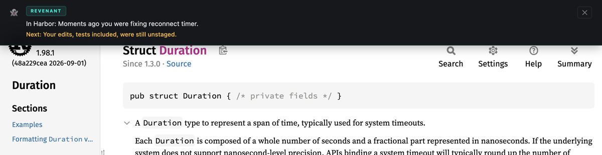

# REVENANT

**Revenant shows you where you left off in your code when you come back from a break, a meeting or another branch.**

It runs in the background on macOS and Linux. When you leave a task, it writes a short note from your git state, your editor and your shell. When you come back, the note is waiting in the first place you look: a new terminal, VS Code or Cursor, or Chrome. It works only from your git state, editor and shell history, and everything stays on your machine.


```bash
curl -fsSL https://raw.githubusercontent.com/derealt/revenant/dev/install.sh | bash
```

Free and open source (MIT). No account, no server, no telemetry.

## The problem

You come back from lunch, a meeting, a weekend, or an hour on someone else's branch, and spend the first ten minutes working out what you were doing.

> "I started keeping a markdown file at the root of every project that captures state and next steps whenever I stop working on it, purely so I can resume without the 20-minute 'wait where was I' tax."
> ([Hacker News, 2026](https://news.ycombinator.com/item?id=47906989))

> "When I sit down to work, I waste 10-15 minutes figuring out where I left off."
> ([Hacker News, 2026](https://news.ycombinator.com/item?id=46596793))

> "I was juggling too many Claude Code sessions across different branches and kept losing track."
> ([Hacker News, 2026](https://news.ycombinator.com/item?id=46512483))

Research on programmers found it takes 10 to 15 minutes to start editing code again after an interruption ([Parnin](https://blog.ninlabs.com/blog/programmer-interrupted)). The usual fixes all need you to do something before you leave: update a notes file, make a WIP commit, stash and hope you remember, or type a sentence into the code that breaks the build. When you are interrupted, you don't get the chance.

Revenant writes the note for you, at the moment you leave, and shows it to you at the moment you return.

## What you see when you come back

**In a new terminal.** Every new shell prints the note for the project you are in.

```
╔══  REVENANT │ Harbor │ 2h ago  ══╗
║ You were fixing reconnect timer in Harbor.
║ → Your edits, tests included, were still unstaged.
╚══ ghost fades in 1min of activity ══╝
```

**In VS Code or Cursor.** A toast says `Resume at reconnect.rs:17`. Click it and your cursor goes back to that line, centred, with the line marked for a minute.

**In Chrome.** After your laptop wakes from sleep, a small banner at the top of the page shows the note. It does not appear while you are working, only when you come back.



**In Obsidian and Slack** (optional). A callout in your vault, or a message only you can see.

Every note disappears after about a minute. Its job is to get you started, then get out of the way.

## When it writes a note

Revenant saves a note for the project you are leaving when you:

- switch to a different project,
- switch git branch, or
- step away for 15 minutes or close the lid.

## What goes into a note

- your branch, what is staged and unstaged, and your recent commits
- the files you changed, by their real names
- the file and line your cursor was on (with the editor extension)
- your last `rg` or `grep` search, because the thing you were searching for is usually the question you were trying to answer
- your recent shell commands

Real notes from the rule engine's test corpus:

```
You were fixing reconnect timer before retry in harbord.
Next: You were mid test-and-fix - your latest edits landed after the last test run.

You were building invoice export scaffolding (billingd).
Next: You were partway into a commit - the changes were already staged.

You were reviewing 'batch_size' (legacy-importer).
Next: You left no half-finished thread on record.
```

A note tells you what was in progress. It never tells you what to do next, and it never guesses. If there is little to go on, the note is short.

By default notes come from a rule engine that runs on your machine with no network. If you want fuller notes, you can point it at a model: Ollama (stays local), Claude or OpenAI.

## Privacy

- **No screen recording, no screenshots, no keystroke logging.** Revenant reads git, file names and times, your shell history file, and what the editor extension reports.
- **Local only.** Notes live in a SQLite file in `~/.revenant/` and are deleted after 30 days. `rvn forget` deletes them now.
- **Web pages can't reach it.** The local server on `127.0.0.1:7711` refuses any request from a web page, so a site you visit can't read your notes or write into the banner. See [SECURITY.md](SECURITY.md).
- **Your files are never touched.** Editor marks, terminal text and banners are drawn on top and disappear.
- **Clipboard and browser tab signals are off** unless you turn them on in the config.

## How it compares

| You use | What it does | What Revenant adds |
|---|---|---|
| Screen memory apps (Screenpipe, Microsoft Recall, Pieces) | Record or read your screen so you can search it later | No recording at all. You don't search: the note is shown to you when you return. |
| VS Code working sets, JetBrains Last Edit Location | Reopen your tabs or jump to your last edit, inside that IDE | Says what you were doing, and shows it in the terminal and browser too, for every project |
| git-standup | Lists yesterday's commits | Covers work you haven't committed, your cursor and your last search |
| A notes file, WIP commits, `git stash` | Works when you remember to do it | Nothing to remember |

## Install

```bash
curl -fsSL https://raw.githubusercontent.com/derealt/revenant/dev/install.sh | bash
```

This downloads the binaries for your platform from the latest release, checks them against the published checksums, puts `revenant` and `rvn` in `~/.local/bin`, adds the shell hook, and starts the daemon (a LaunchAgent on macOS, a systemd user service on Linux). Open a new terminal and it is running.

Or download a release from [Releases](https://github.com/derealt/revenant/releases), put both binaries on your PATH and run `rvn init`.

Then add the places you want notes to appear:

```bash
rvn setup vscode              # VS Code or Cursor extension
rvn setup browser             # Chrome extension
rvn setup obsidian --vault ~/notes
rvn setup llm                 # optional: fuller notes from Ollama, Claude or OpenAI
```

Each command prints the exact download and install steps.

## Commands

```bash
rvn status            # Is the daemon running, which channels are live, the latest note
rvn history           # Past notes (-p DIR for one project, -n 20 for more)
rvn digest            # Where your attention went across projects, last 7 days
rvn test              # Show a test note everywhere
rvn clear             # Dismiss the current note everywhere
rvn off / rvn on      # Stop or start the daemon
rvn forget            # Delete notes for this project (--all for everything)
```

## Requirements

- macOS (Apple Silicon or Intel), or Linux (x86_64 or arm64) with systemd
- zsh, bash or fish
- Optional: VS Code or Cursor, Chrome, Obsidian

The daemon uses about 12 MB of memory and no measurable CPU when idle. Native Windows is not supported yet; the Linux build may work inside WSL2 with systemd enabled.

## Contributing

Bug reports and wrong notes are the most useful thing you can send. If a note said something that wasn't true, open a ["The card was wrong"](https://github.com/derealt/revenant/issues/new?template=wrong-card.yml) issue. See [CONTRIBUTING.md](CONTRIBUTING.md) to build and test.

## License

MIT. Maintained by [Syntaxe](https://syntaxeltd.com).
